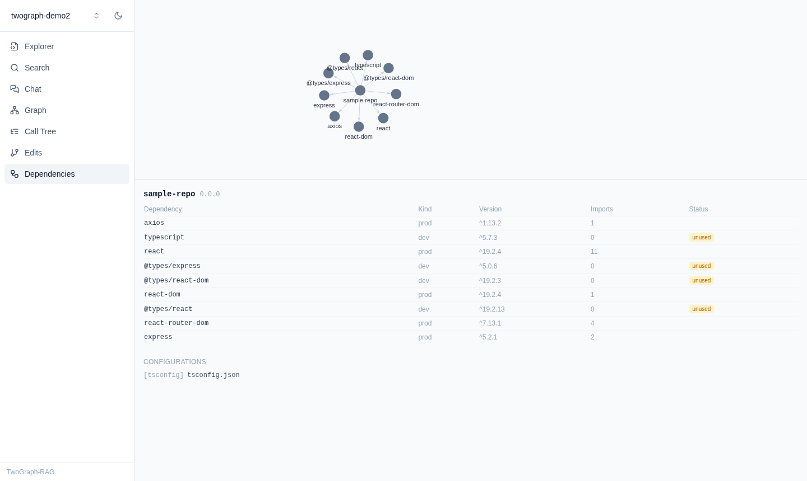

# TwoGraph-RAG

[](https://github.com/Nahid-NHB/TwoGraph-RAG/actions/workflows/ci.yml)

> AI-powered code intelligence for JavaScript, TypeScript, and React codebases — AST parsing, knowledge graphs, hybrid semantic search, and grounded RAG in one platform.

TwoGraph-RAG analyzes entire repositories with Tree-sitter, builds a persistent knowledge graph in Memgraph, indexes code semantically with local (or API-based) embeddings, and answers complex developer questions through a hybrid retrieval pipeline (BM25 + vectors + graph traversal → RRF → cross-encoder reranking). It can also **edit code safely via AST transformations** with diff previews and approval gates, and keeps itself up to date as files change.

Think _Sourcegraph Cody + Greptile + GraphRAG + Cursor_, focused on the JS/TS/React ecosystem, fully open source.

```
Question → Multi-Query → Hybrid Search → Graph Expansion → RRF → Rerank → Context Assembly → LLM → Grounded Answer
```



## Quickstart (5 minutes)

Packages aren't published to npm yet (tracked in [#76](../../issues/76)) — for now, run from a clone.

**Prerequisites**: Node ≥ 22, Docker, [pnpm](https://pnpm.io).

```bash
git clone https://github.com/Nahid-NHB/TwoGraph-RAG.git
cd TwoGraph-RAG
pnpm install
docker compose up -d          # Memgraph :7687, Qdrant :6333
pnpm build
```

Index a repo and ask it a question — `examples/sample-repo` is a small fixture repo bundled for exactly this:

```bash
cd examples/sample-repo
node ../../packages/cli/dist/main.js init      # writes .twograph/config.json
node ../../packages/cli/dist/main.js index     # parses, builds the graph, embeds
node ../../packages/cli/dist/main.js search "verify jwt token"   # no LLM needed
```

`search` works out of the box — semantic embedding is fully local (ONNX) by default. `query` (grounded RAG "ask") needs an LLM: set `ANTHROPIC_API_KEY` (default provider) or edit `.twograph/config.json`'s `llm` block to switch to `openai`/`gemini`/`ollama`/`openrouter`, then:

```bash
export ANTHROPIC_API_KEY=sk-...
node ../../packages/cli/dist/main.js query "how does authentication work?"
```

Want the web UI instead of the terminal? From the repo root:

```bash
node packages/cli/dist/main.js serve &          # REST API on :4801
pnpm --filter @twograph/web dev                 # opens on :5173, register the repo's path in the UI
```

## Capabilities

- **Whole-repo understanding** — functions, classes, hooks, components, props, contexts, routes, API handlers, imports/exports, tests, configs
- **Knowledge graph** — 20+ node types, 20+ edge types (CALLS, IMPORTS, USES_HOOK, PROVIDES_CONTEXT, …), incrementally updated, never rebuilt from scratch
- **Semantic search** — "authentication" finds `verifyToken()`, `validateJWT()`, `login()` even when the word never appears
- **Grounded answers** — every answer cites files, functions, snippets, and graph paths, verified against real file spans
- **AST-based editing** — rename, move, extract, parameter changes; never regex; approval required before writes
- **Dead code & dependency analysis** — reachability from entry points, full dependency graph from package.json/tsconfig/bundler configs, with a web dependency explorer and expandable call/component-usage trees
- **Real-time indexing** — filesystem watcher reparses and updates graph + embeddings incrementally
- **Caching** — content-hash embedding cache survives restarts; generation-keyed LRU caching for hot graph queries and RAG search/multi-query results
- **Benchmarks** — `pnpm bench` tracks indexing throughput/latency and retrieval quality against a committed baseline, gated in CI
- **MCP server** — `repository_summary`, `semantic_search`, `query_graph`, `call_hierarchy`, `component_usage`, `dependency_graph`, `dead_code`, `edit_function`, `optimize_function`
- **Modern web UI** — repository explorer, graph visualization, call/component hierarchy trees, chat, diff viewer, dependency explorer, dark mode
- **Interchangeable LLMs** — Anthropic, OpenAI, Gemini, Ollama, OpenRouter

## Documentation

| Doc                                                 | Contents                                  |
| --------------------------------------------------- | ----------------------------------------- |
| [Requirements](docs/01-requirements.md)             | Functional & non-functional requirements  |
| [Architecture](docs/02-architecture.md)             | Components, package layout, data flow     |
| [Folder Structure](docs/03-folder-structure.md)     | Monorepo layout                           |
| [Database Schema](docs/04-database-schema.md)       | SQLite metadata store, Qdrant collections |
| [Knowledge Graph Schema](docs/05-graph-schema.md)   | Node labels, edge types, Cypher patterns  |
| [API Design](docs/06-api-design.md)                 | REST/SSE API, MCP tools, CLI              |
| [Retrieval Pipeline](docs/07-retrieval-pipeline.md) | Hybrid retrieval + RAG pipeline           |
| [Editing Pipeline](docs/08-editing-pipeline.md)     | AST editing with approval workflow        |
| [Extension Points](docs/09-extension-points.md)     | Plugging in languages, stores, providers  |

## MCP server

`@twograph/mcp` exposes the index to any MCP-compatible agent (Claude Code, Claude Desktop, Cursor, …) via `repository_summary`, `semantic_search`, `query_graph`, `call_hierarchy`, `component_usage`, `dependency_graph`, `dead_code`, `edit_function`, and `optimize_function`. Index a repo first (`twograph init && twograph index`), then run:

```bash
twograph mcp             # stdio (default) — for clients that spawn a child process
twograph mcp --http      # streamable HTTP on :4802 (POST/GET/DELETE http://localhost:4802/mcp)
```

**Claude Code**: `claude mcp add twograph -- twograph mcp`

**Claude Desktop** (`claude_desktop_config.json`):

```json
{
  "mcpServers": {
    "twograph": {
      "command": "twograph",
      "args": ["mcp"]
    }
  }
}
```

Every tool takes a `repo` argument — the absolute path to an already-indexed repository root.

## FAQ

**Does my code get sent to an LLM?** Only the context blocks assembled for a specific question/edit-suggestion (via `query`, chat, or `optimize`) go to your configured LLM provider. Parsing, graph-building, and the default embedder all run locally — `search`, `deadcode`, and `deps` never call an LLM at all.

**Which LLMs are supported?** Anthropic, OpenAI, Gemini, Ollama (fully local), and OpenRouter — see [Extension Points](docs/09-extension-points.md#5-llm-providers). Switching is a one-line config change.

**Is this production-ready?** Pre-1.0 and under active development (see [milestones](../../milestones)). Core indexing/search/RAG/editing paths are covered by the [release-gate e2e test](packages/server/test/integration/e2e-smoke.int.test.ts) that runs in CI on every change.

**How is this different from Cursor/Copilot/Cody?** Those are primarily editor-integrated code assistants. TwoGraph-RAG is a standalone knowledge-graph + retrieval platform (CLI, REST API, MCP server, web UI) you can point any MCP-compatible agent at, index once and query many ways, and inspect directly (graph visualization, dependency explorer, dead-code report) without needing an editor plugin.

**What's next?** See the non-goals/roadmap in [Extension Points §9](docs/09-extension-points.md#9-planned-future-work-non-goals-for-v0x) and the [open milestones](../../milestones).

## Development

```bash
pnpm install
docker compose up -d   # Memgraph + Qdrant
pnpm test
pnpm build && pnpm bench   # indexing + retrieval benchmarks vs scripts/bench/baseline.json
```

See [CONTRIBUTING.md](CONTRIBUTING.md). Work is organized into 10 milestones; every change lands as one PR closing one issue. Please also read our [Code of Conduct](CODE_OF_CONDUCT.md); see [SECURITY.md](SECURITY.md) to report a vulnerability.

## License

MIT
