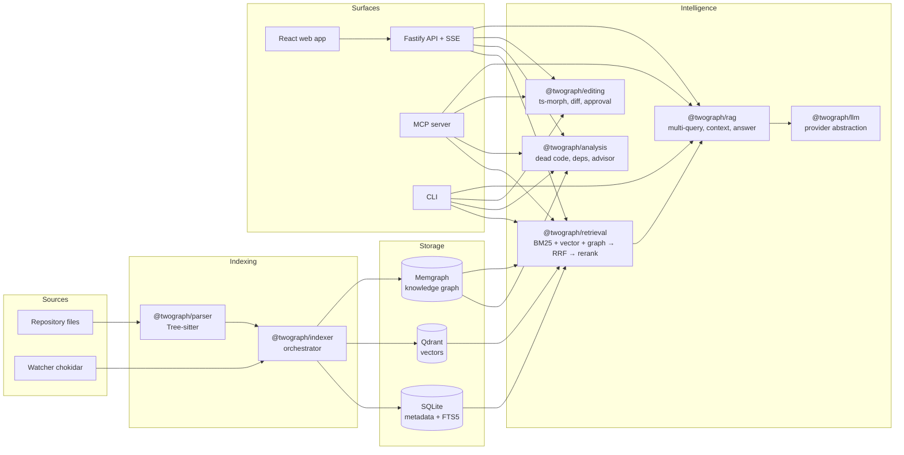

# Architecture

## 1. Overview

TwoGraph-RAG is a pnpm monorepo of focused TypeScript packages behind three delivery surfaces (HTTP API, MCP server, CLI) and one web app. Two datastores hold derived state — Memgraph (structure) and Qdrant + SQLite (search) — and all derived state is rebuildable from source code, keyed by stable symbol IDs.

## 2. Package responsibilities

| Package | Responsibility | Key deps |
| --- | --- | --- |
| `@twograph/core` | Domain types (Symbol, Chunk, EdgeKind…), stable IDs, config loader, errors, logging | zod, pino |
| `@twograph/parser` | Tree-sitter parsing, per-language extractors, plugin registry | tree-sitter, grammars |
| `@twograph/graph` | Memgraph client, schema bootstrap, upserts, typed queries | neo4j-driver (Bolt) |
| `@twograph/vector` | Embedding providers (UniXcoder/ONNX), Qdrant store, chunking | @qdrant/js-client, onnxruntime-node |
| `@twograph/store` | SQLite metadata (files, symbols, chunks, edits, chats) + FTS5 BM25 | better-sqlite3 |
| `@twograph/indexer` | Orchestrates parse → graph → chunks → embeddings; watcher; incremental diffing | chokidar |
| `@twograph/retrieval` | Retrievers, RRF, cross-encoder reranker, context assembly | transformers.js |
| `@twograph/llm` | Provider interface + Gemini/OpenAI/Anthropic/Ollama/OpenRouter | provider SDKs |
| `@twograph/rag` | Multi-query, pipeline, grounding, citations, chat sessions | — |
| `@twograph/editing` | AST edit operations, diff preview, approval journal | ts-morph, diff |
| `@twograph/analysis` | Dead code, dependency analysis, optimization advisor | — |
| `@twograph/server` | Fastify REST + SSE | fastify |
| `@twograph/mcp` | MCP tool server | @modelcontextprotocol/sdk |
| `@twograph/cli` | `twograph` command | commander |
| `apps/web` | React UI | vite, react, tailwind |

**Dependency rule:** `core ← {parser, graph, vector, store} ← indexer ← {retrieval, analysis} ← rag ← {server, mcp, cli}`. `editing` depends only on `core` + `graph`. No package imports a surface. No cycles (enforced by lint).

## 3. Data flow

### 3.1 Indexing
1. **Discover** — walk repo, apply ignore rules, hash file contents (xxhash).
2. **Diff** — compare hashes against `files` table → added/changed/removed sets.
3. **Parse** — Tree-sitter per file → `ParsedFile { symbols, imports, exports, references, docs }`.
4. **Graph write** — per file, in one transaction: detach-delete the file's owned symbol nodes, MERGE current nodes/edges. Route nodes are upserted, never deleted implicitly.
5. **Resolve** — second pass links cross-file edges (CALLS, USES_COMPONENT…) using the import graph.
6. **Chunk + embed** — symbol-aware chunks; embed only chunks whose content hash changed; upsert into Qdrant + FTS5.
7. **Commit** — update `files` table; journal an indexing run.

### 3.2 Question answering
Question → multi-query generation (LLM) → each query hits BM25 + vector + graph retrievers in parallel → seeds expanded 1–2 hops in graph → RRF fusion → cross-encoder rerank → token-budgeted context assembly (code, signatures, docs, caller/callee chains, related files) → LLM with grounding instructions → answer with citations `{file, symbol, lines, graphPath}` streamed over SSE.

### 3.3 Editing
Edit request → validate target symbol via graph → ts-morph transformation in-memory across all affected files → unified diff preview persisted as a **pending edit** → user approves → files written atomically, edit journaled → indexer reindexes affected files. Reject/expire discards. Details in [08-editing-pipeline.md](08-editing-pipeline.md).

## 4. Key decisions (ADR summary)

| # | Decision | Rationale |
| --- | --- | --- |
| 1 | Memgraph over Neo4j | in-memory speed, Cypher-compatible, lightweight docker image; uses standard Bolt driver so Neo4j remains a drop-in |
| 2 | Qdrant for vectors | filtered ANN search, payload storage, easy docker; store interface keeps it swappable |
| 3 | SQLite (better-sqlite3) for metadata + BM25 | zero-ops, FTS5 gives solid BM25; keeps dev-stack to 2 containers |
| 4 | Tree-sitter for parsing, ts-morph for editing | Tree-sitter = fast, error-tolerant, multi-language reads; ts-morph = type-aware safe writes for TS/JS |
| 5 | ONNX (onnxruntime-node) for UniXcoder + cross-encoder | local, CPU-friendly, no Python sidecar |
| 6 | Stable symbol IDs as the universal join key | joins graph ↔ vectors ↔ metadata; survives reindex |
| 7 | Derived state is disposable | any store can be wiped and rebuilt from source; enables aggressive incrementality |
